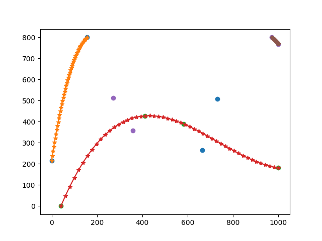
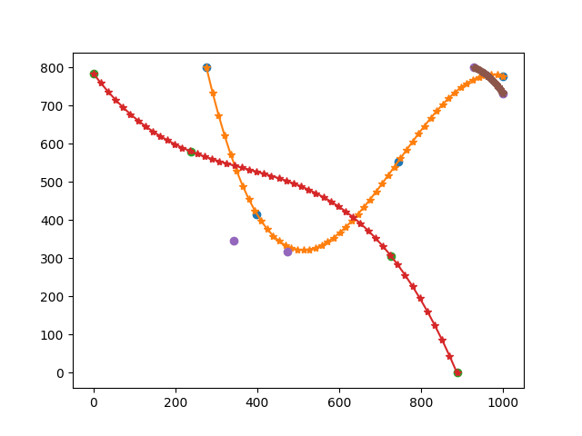
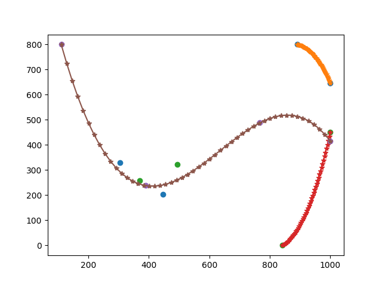
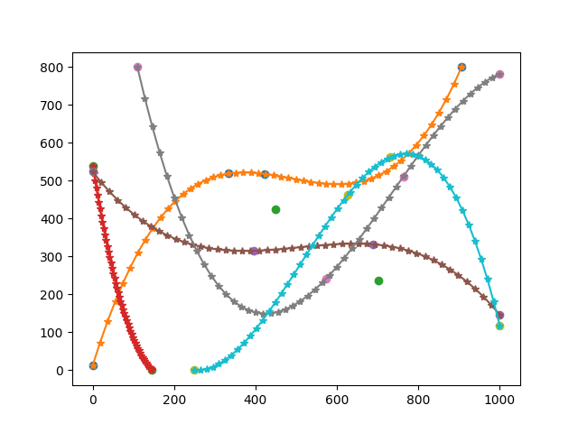
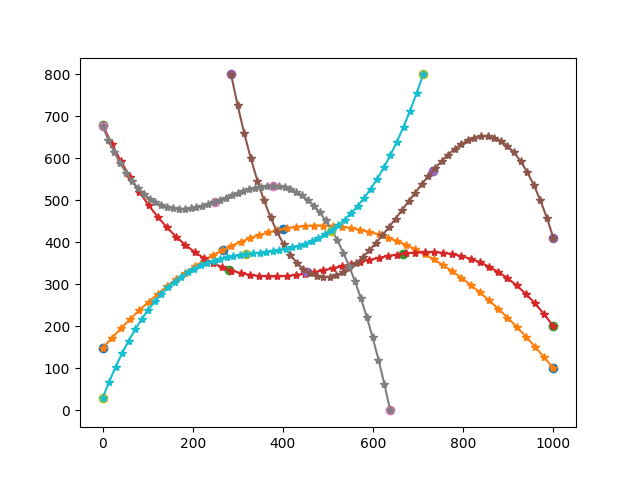
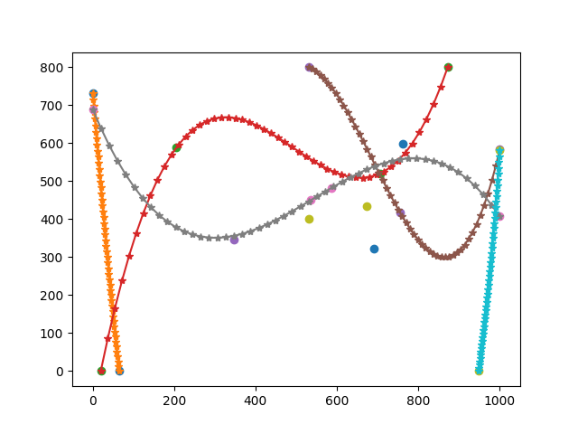
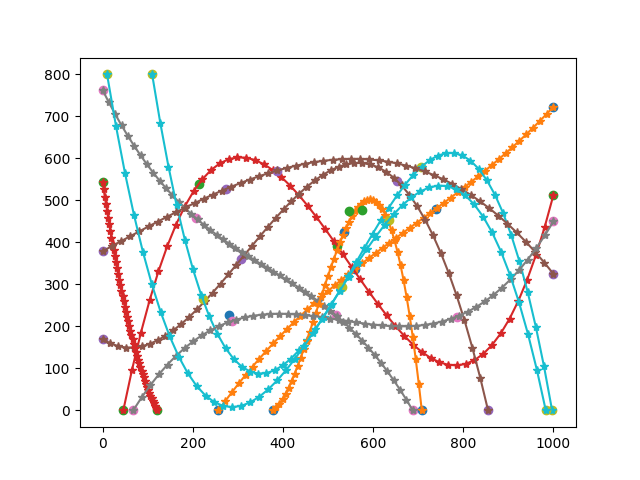
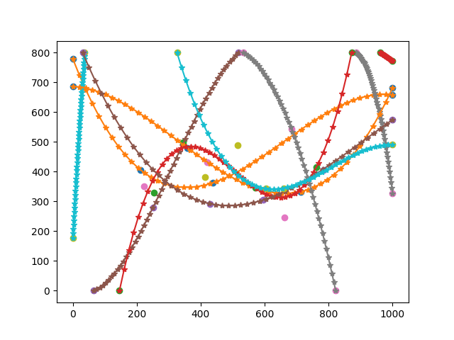
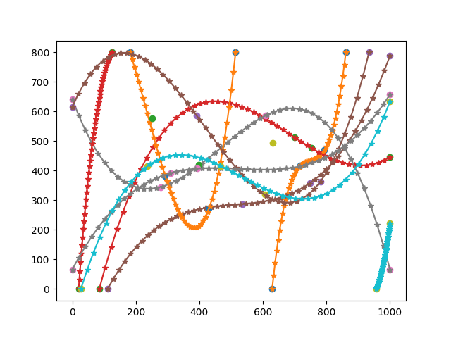

# Отчет по трекеру.

Команда: Сбитнева Людмила, Гринкевич Павел

### Трекер построен на основе центроидов и евклидова расстояния между ними.

Хорошо справляется с изменением параметра random_range (на сколько пикселей рамка объектов может ложно смещаться (эмуляция не идеальной детекции)

В целом приемлемо работает только тогда, когда есть детекция на каждом фрейме каждого объекта и их траектории не пересекаются. Во всех остальных случаях работает плохо.

## Эксперименты:
Провели эксперименты на 9 треках:

tracks = 3, random_range = 10, skip_percent = 0

tracks = 3, random_range = 10, skip_percent = 25

tracks = 3, random_range = 25, skip_percent = 0

tracks = 5, random_range = 10, skip_percent = 0

tracks = 5, random_range = 10, skip_percent = 25

tracks = 5, random_range = 25, skip_percent = 0

tracks = 10, random_range = 10, skip_percent = 0

tracks = 10, random_range = 10, skip_percent = 25

tracks = 10, random_range = 25, skip_percent = 0

## Таблица

| Tracks amount | Random range | Skip Percent | Result hungarian | Result hungarian + kalman |
|---------------|--------------|--------------|------------------|---------------------------|
| 3             | 10           | 0            | 0                | 0                         |
| 3             | 10           | 25           | 0                | 0                         |
| 3             | 25           | 0            | 0                | 0                         |
| 5             | 10           | 0            | 0                | 0                         |
| 5             | 10           | 25           | 0                | 0                         |
| 5             | 25           | 0            | 0                | 0                         |
| 10            | 10           | 0            | 0                | 0                         |
| 10            | 10           | 25           | 0                | 0                         |
| 10            | 25           | 0            | 0                | 0                         |
